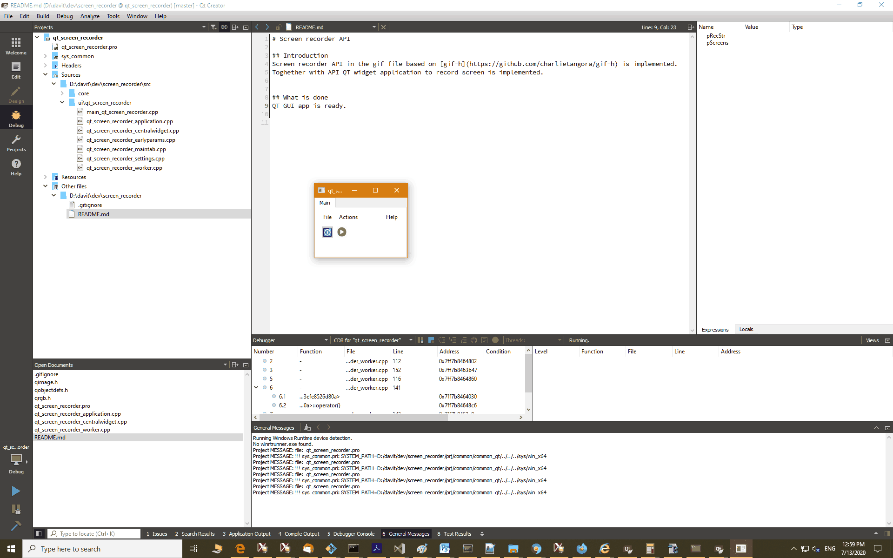

# Screen recorder API  
  
## Introduction  
Screen recorder API in the gif file based on [gif-h](https://github.com/charlietangora/gif-h) is implemented. 
Toghether with API QT widget application to record screen is implemented.  
  
  
## What is done  
QT GUI app is ready.  
  
  
## Example  

  

